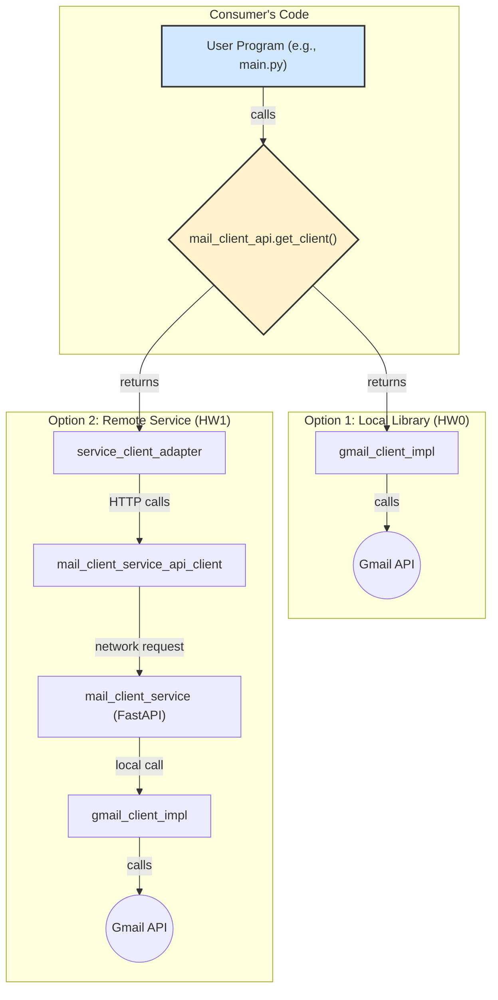

# Homework 2

## Intro

Congratulations on successfully implementing your Gmail service adapter in Homework 1! You navigated the foundational steps of turning a local **component** into a discoverable **service** that remains locally usable via the **Adapter Pattern**.

To recap the components we focused on was:

1. **Interface API (Contract):** Defining the abstract interface for what your package does.
2. **Implementation:** Building the core logic that wraps an external API (like Gmail).
3. **FastAPI Service (Deployment Unit):** Exposing your core logic over HTTP endpoints.
4. **Auto-generated Client:** Using tools like `openapi-python-client` to create a thin, type-safe network client from your service's OpenAPI spec.
5. **Service Client Adapter:** Wrapping the auto-generated client with the original Interface API, hiding the network details from the end-user.

This architecture ensures that whether the code is running as a local library or as a remote service is merely a matter of geography—the consumer's code doesn't have to change.

In this next assignment, you will apply this entire cycle to a **new problem domain** and, most importantly, **elevate your professional development practices and system architecture.**

## Remarks and Increased Expectations

We saw a lot of great work in Homework 1. For Homework 2, we will be stricter about the development process. Please take note of the following:

### Commits and Pull Requests

Many PRs contained a large number of small, iterative commits. While committing frequently is good practice during development, it makes the final review process difficult.

For HW2, your workflow should be structured as follows:

1. Create a main branch for the assignment (e.g., `hw2`).
2. For each significant piece of work (e.g., designing the API, implementing the chat logic, setting up authentication), create a new **feature branch** off your `hw2` branch (e.g., `hw2-api-design`).
3. You can have as many commits as you want on your feature branch.
4. When the feature is complete, **squash and merge** the feature branch into your `hw2` branch. This condenses all the intermediate work into a single, meaningful commit on the main assignment branch. For example, 30 commits on `hw2-api-design` can become one commit on `hw2` titled "feat: Design and implement the core service API".
5. Your final PR to the class repository should be from your `hw2` branch, containing a clean history of these squashed feature commits.

Also, remember these big no-nos:

- **Do not push directly to `main`**. All work must go through PRs.
- **Always rebase** to incorporate changes made by TAs. This avoids messy merge commits and keeps your contribution history clean.

### MyPy and Ruff

Your code must pass `mypy` and `ruff` checks. These are not hassles; they are essential tools for writing safe, maintainable Python.

- **Mypy:** Do not ignore Mypy errors with `type: ignore` unless you have a very specific, documented reason. An error from Mypy indicates a potential issue with your type safety or configuration.
    
- **Ruff:** A few `noqa` comments are acceptable for niche cases (especially in tests), but they must be explained. Your source code should not be littered with ignored rules.
    
- **Workflow:** Run these tools **consistently as you code**, not just at the end. This helps catch issues early and keeps your codebase clean.
    

### CircleCI

Set up your CircleCI configuration **as early as possible**. Don't wait until the end of the assignment. This allows you to see if your changes are breaking the build throughout your development process.

### Authentication

In HW1, the method for handling authentication was a simple workaround to get things running locally. For HW2, we expect a more robust, professional implementation.

Your new service must implement a proper **OAuth 2.0 flow**. When a user needs to authenticate, your service should:

1. Redirect the user to an external provider (e.g., Google).
    
2. Handle the callback from the provider.
    
3. Receive the credentials (e.g., access token, refresh token).
    
4. Securely **store these credentials in a database** associated with the user.
    

Subsequent requests from that user will use the stored credentials to interact with the underlying API (e.g., Slack, OpenAI, etc.).

---

## The Assignment

### Objective

The primary goal of this assignment is to design, implement, and deploy a complete, standalone microservice from scratch. You will select a service category, define its API, build its core functionality including user authentication, and make it publicly accessible. This project will build upon the skills you developed in HW1 and challenge you to think about system architecture and user interaction.

### Instructions

1. **Service Selection:** Each team will choose **one** of the following service categories to implement. Please coordinate on the class Slack channel to avoid duplication.
    
    - **Chat Service** (e.g., wrapping the Slack, Discord, or WhatsApp API)
        
    - **Mail Service** (e.g., wrapping the Outlook or another mail provider's API)
        
    - **AI Service** (e.g., providing an interface to an AI model like OpenAI's GPT or Anthropic's Claude)
        
    - **Issue Tracker** (e.g., wrapping the Jira, Trello, or Asana API)
        
2. **API Design First:** Before you write any implementation code, your first task is to design the API for your service. This should be your **first pull request**. Define the endpoints, request/response structures, and data models. Think about how other developers would want to interact with your service.
    
3. **Implementation:**
    
    - **Core Logic:** Implement the main features of your chosen service.
        
    - **User Authentication:** This is a key requirement. Your service must handle user authentication as described in the "Remarks" section. When a user interacts with your service, they should be able to log in via an external provider. Your service will then handle the authentication flow, receive credentials (like a token), and store them in a database.
        
    - **Structure:** You can use the project structure from Homework 1 as a starting point.
        
4. **Deployment:** Deploy your completed service to a cloud platform (like Render) and ensure it is publicly accessible via a URL.
    
5. **Development Process and Documentation:**
    
    - Break your work into smaller, logical pull requests following the squash-merge workflow described above.
        
    - Maintain your `CONTRIBUTING.md` and `DESIGN.md` documents, updating them as your project evolves.
        

### Extra Credit

For teams looking for an additional challenge, extra credit will be offered for:

- **Containerization:** Package your application using **Docker**.
    
- **Orchestration:** Deploy your containerized service using **Kubernetes**.
    
- **Advanced Integration Prep:** Implement an **NCMP (Nano-Composable Micro-Protocol) server** for your service. This will set the stage for more complex integrations in future assignments.
    

---

## Key Takeaways

- **From Concept to Deployment:** You'll experience the full lifecycle of creating a new service.
    
- **API-First Design:** Emphasizing the importance of a well-thought-out API before implementation.
    
- **Robust Authentication:** Gaining hands-on experience with a critical component of modern applications.
    
- **Iterative Development:** Reinforcing the practice of incremental progress and continuous feedback through a professional Git workflow.
    

---

## Timeline and Submission

This is a two-week assignment.

- **Build (First Draft PR):** Friday, October 31st @ Midnight
    
    - Submit a PR from your `hw2` feature branch. **Do not merge!**
        
- **Review:** Tuesday, November 4th @ Midnight
    
    - You will provide peer review for an assigned team and receive feedback from TAs.
        
- **Iterate (Final Submission):** Wednesday, November 12th @ Midnight
    
    - Address all feedback, complete any optional tasks, merge your PR, and submit the link to the final merged commit on the student portal.
        

---

## Checklist on Motions

Submitting work that fails these checks is considered an incomplete submission.

- **`uv`:** `uv` is your package manager. No `requirements.txt` or `pip`. `pyproject.toml` only.
    
- **Code Quality and Static Analysis:** Use `ruff` (`ruff check`) and `mypy` (`mypy src tests`). Make sure it all passes.
    
- **Testing and Coverage:**
    
    - Does your submission include comprehensive unit, integration, and E2E tests?
        
    - Does your code meet or exceed the coverage percentage defined in your root `pyproject.toml`? A failing coverage check is a failing build.
        
- **Continuous Integration:**
    
    - Have you pushed your latest commits to your team's remote feature branch on GitHub?
        
    - Is your CircleCI build for that branch passing?
        
    - Is your CircleCI project public?
        
- **Documentation:**
    
    - Have you updated the documentation in the root `README.md` and in the `README.md` file for each component you created or modified?
        
    - Does your `mkdocs` documentation build correctly and reflect the current state of your project?
        
- **PRs and Commits:**
    
    - Does your PR have a descriptive title and a clear summary of the changes?
        
    - Is your commit history meaningful and concise, following the squash-merge workflow?